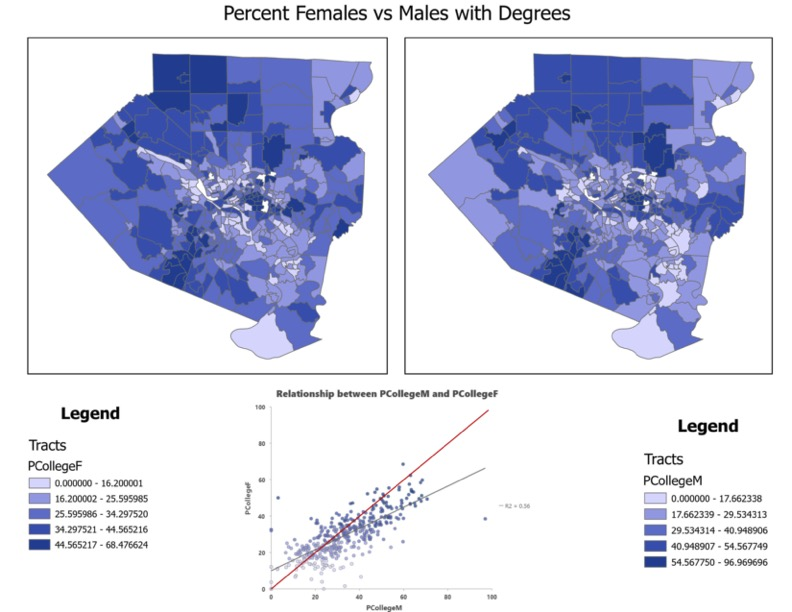
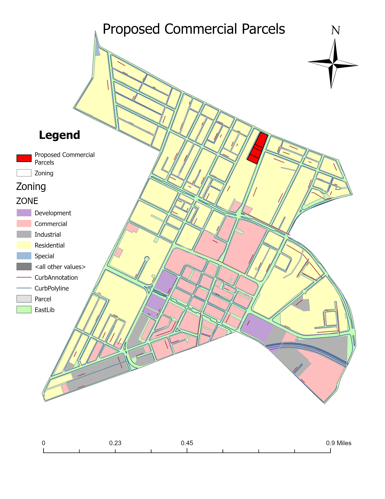
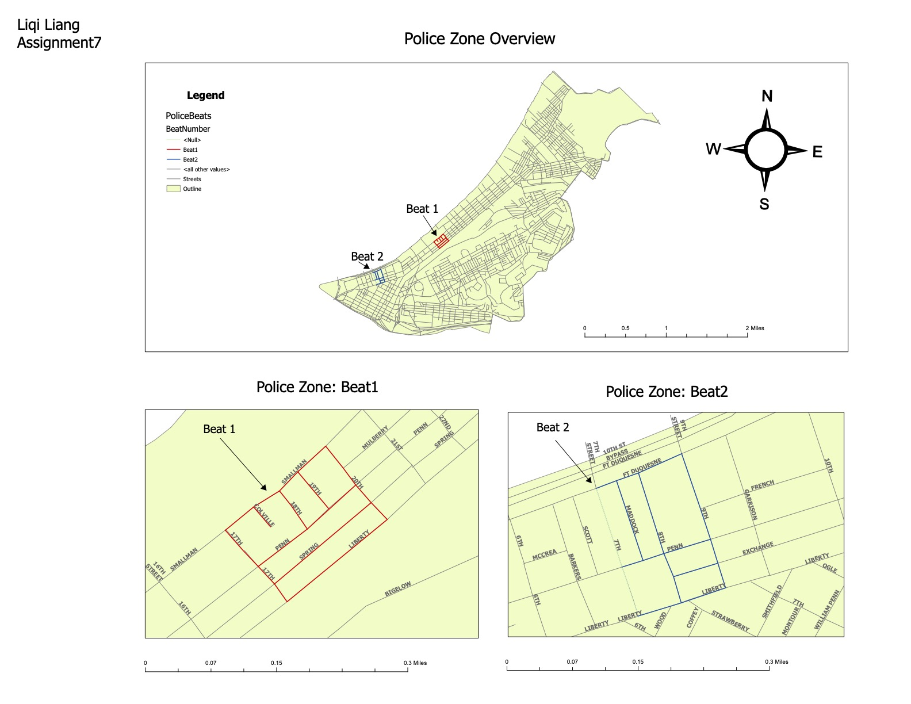
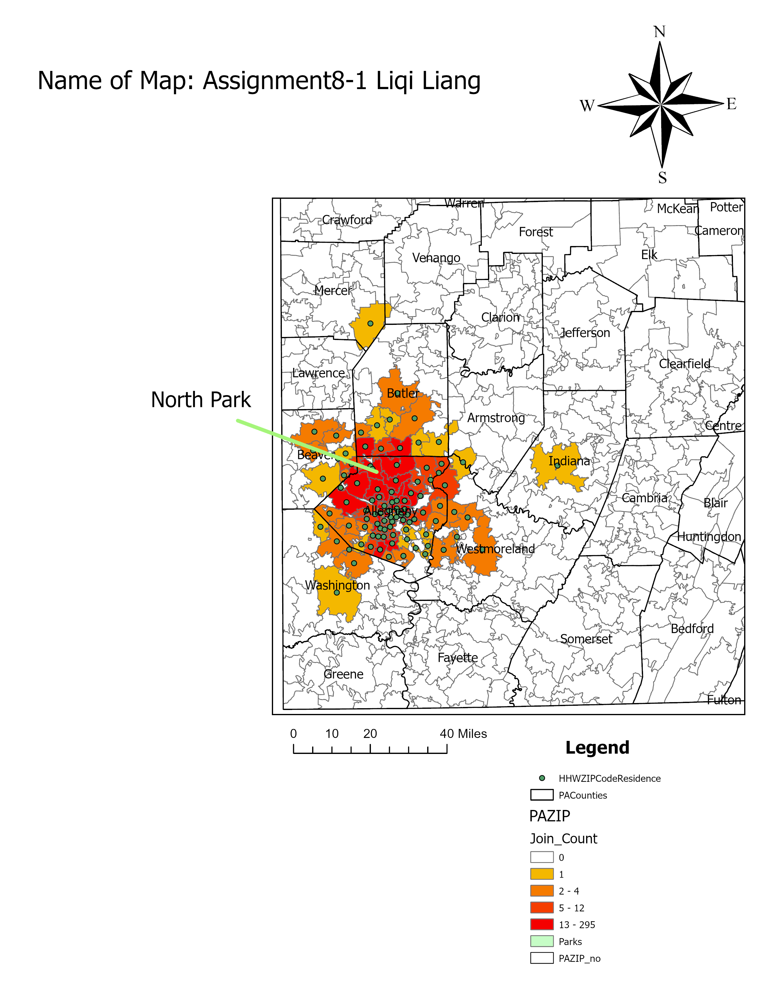
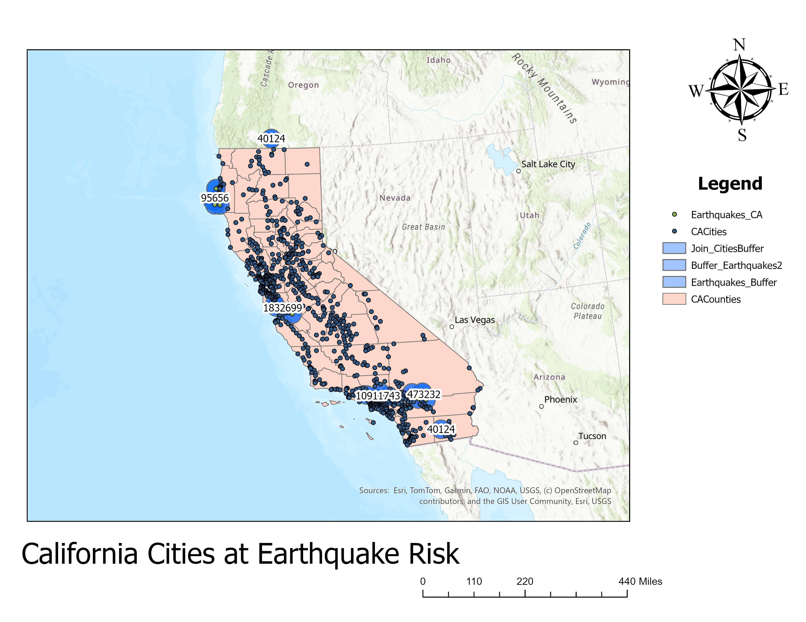
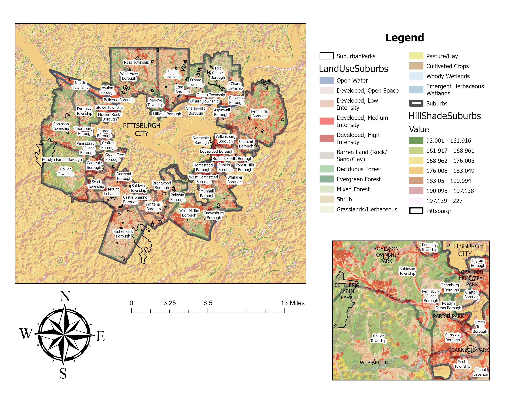
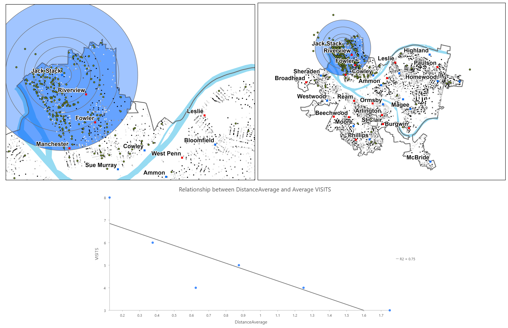

# Pittsburgh & Beyond: Community Mapping with GIS

A collection of spatial analysis projects completed in ArcGIS Pro, covering urban land use, public safety, park accessibility, demographic patterns, and environmental risk. All analyses focus on applied policy-relevant questions using real municipal and census data.

**Tools:** ArcGIS Pro · Spatial Join · Buffer Analysis · Choropleth Mapping · Geocoding · OLS Regression

---

## Projects

### 1. Poverty and Crime: A Spatial Analysis of Pittsburgh Neighborhoods
**File:** `01_poverty_crime_pittsburgh.jpg`

Census tract-level choropleth map of Pittsburgh overlaid with crime incident points, paired with a scatter plot examining the relationship between population below the poverty level and serious crime counts by tract. The OLS regression (R² = 0.23) indicates a moderate positive association, though substantial variation suggests the presence of other contributing factors not captured by poverty alone.

---

### 2. Gender Gap in College Degree Attainment: Phoenix Metropolitan Area
**File:** `02_college_degree_gender_phoenix.jpg`  
**File:** `02_college_degree_gender_phoenix.pdf`

Side-by-side choropleth maps comparing the percentage of females (PCollegeF) and males (PCollegeM) with college degrees across census tracts in the Phoenix metro area. The accompanying scatter plot (R² = 0.56) shows a strong positive correlation between male and female degree attainment rates at the tract level, with the red 45° reference line indicating that females slightly outpace males in high-attainment tracts.

---

### 3. Proposed Commercial Parcels: East Liberty Zoning Analysis
**File:** `03_commercial_parcels_eastliberty.jpg`

Parcel-level zoning map of the East Liberty neighborhood in Pittsburgh, identifying proposed commercial parcels (highlighted in red) within an existing mixed-use zoning context. The map layers curb annotation, polylines, and zoning classifications (residential, commercial, industrial, development) to support land use planning decisions.

---

### 4. Police Beat Delineation: Pittsburgh Zone Mapping
**File:** `04_police_beats_pittsburgh.jpg`  
**File:** `04_police_beats_pittsburgh.pdf`

Multi-scale layout mapping two newly defined police patrol beats within Pittsburgh's East End. The overview map provides neighborhood context; two inset maps zoom into Beat 1 (Strip District corridor along Smallman/Penn) and Beat 2 (downtown grid around Liberty/Penn). Street-level delineation supports resource allocation and patrol planning.

---

### 5. Household Hazardous Waste Event: Attendee Residence Patterns
**File:** `05_hhw_attendees_northpark.jpg`

ZIP-code-level choropleth map of western Pennsylvania showing the residential distribution of attendees at a Household Hazardous Waste (HHW) disposal event held at North Park. Attendance density (Join_Count) is highest in ZIP codes immediately surrounding North Park and decreases with distance, consistent with distance-decay patterns. The top 20% of attendees traveled approximately 10–15 miles, with a small share traveling up to 20 miles.

---

### 6. California Cities at Earthquake Risk: Buffer Analysis
**File:** `06_earthquake_risk_california.jpg`

Statewide map of California identifying cities within proximity of recorded earthquake epicenters using multi-ring buffer analysis. Buffer zones are generated around both earthquake locations and city centroids, with spatial joins used to count cities falling within each risk threshold. Earthquake activity is concentrated along the Sierra Nevada foothills and Southern California coastal zones.

---

### 7. Suburban Land Use and Terrain: Pittsburgh Metro Area
**File:** `07_landuse_hillshade_pittsburgh_suburbs.jpg`

Multi-layer map of Pittsburgh's suburban municipalities combining NLCD land use classification (developed intensity, forest types, wetlands, agricultural land) with hillshade terrain rendering. Suburban park boundaries are overlaid to show the relationship between green space, topography, and development patterns. An inset map highlights the western suburbs including Robinson Township Park, Crafton Municipal Park, and Carnegie Park.

---

### 8. Park Accessibility and Distance Decay: Pittsburgh Neighborhoods
**File:** `08_park_accessibility_pittsburgh.jpg`

Two-panel map analyzing park accessibility across Pittsburgh neighborhoods. The left panel shows multi-ring distance buffers centered on Riverview Park, with resident locations indicating who lives within each distance band. The right panel shows neighborhood-level coverage across the city. The scatter plot (R² = 0.75) demonstrates a strong negative relationship between average distance to parks and average park visit frequency — neighborhoods farther from parks show significantly lower visitation rates.

---
